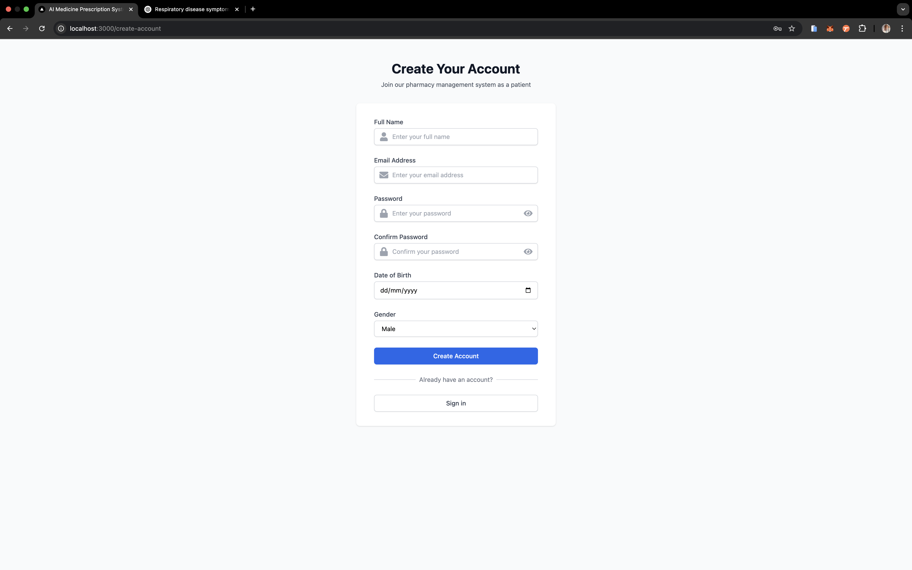
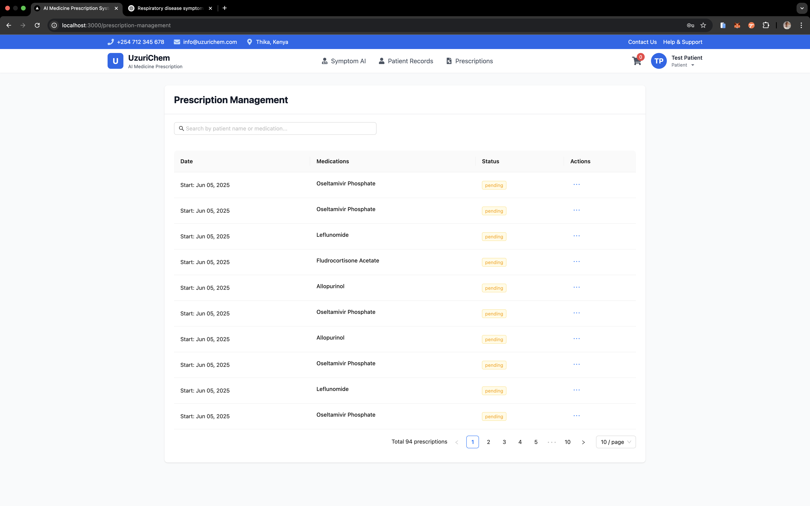
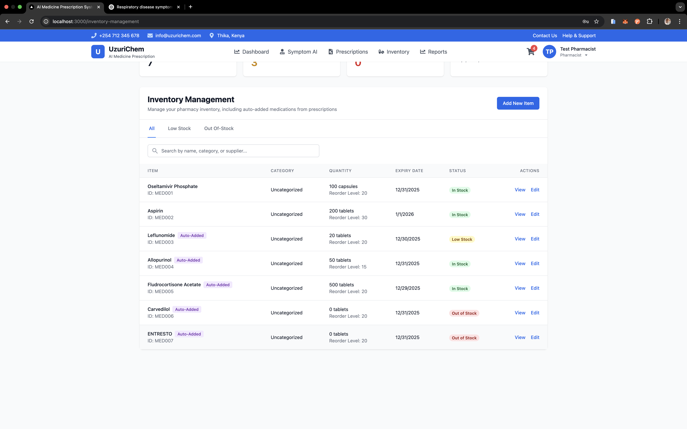

# AI Medicine Prescription System - AI-Powered Healthcare Assistant


AI Medicine Prescription System is an intelligent healthcare management system developed for Uzuri Chem Pharmacy in Thika, Kenya. Powered by Tabitha, an AI assistant, the system helps healthcare providers manage medical information and provide preliminary diagnoses based on symptoms. The system uses AI/ML to analyze symptoms and provide medication recommendations while maintaining secure patient records and prescriptions.

## Project Context

Uzuri Chem Pharmacy serves an average of 150 patients daily, with patients coming from Thika Road and surrounding areas including Muranga. The system was developed to address key challenges faced by the pharmacy:

- High patient volume leading to overwhelmed healthcare providers
- Delays in retrieving medical records
- Risk of misdiagnosis due to manual record management
- Need for accurate and timely medication recommendations
- Patient trust issues due to past medication errors

## Project Objectives

### General Objective

To develop an AI Medicine Prescription System for Uzuri Chem Pharmacy that enhances diagnostic accuracy and treatment efficiency.

### Specific Objectives

1. Analyze existing AI medicine prescription systems
2. Design an AI medicine prescription system tailored to Uzuri Chem Pharmacy's needs
3. Implement the AI medicine prescription system
4. Evaluate the system's performance and effectiveness

## Features

### AI-Powered Symptom Analysis

- Natural language processing for symptom extraction
- Disease prediction with confidence scores
- Medication recommendations based on symptoms and patient history
- Drug interaction checking
- Real-time symptom analysis
- Historical symptom pattern recognition
- Personalized treatment recommendations

### Patient Management

- Patient registration and profile management
- Comprehensive medical history tracking
- Prescription history management
- Role-based access control
- Patient record viewing and editing
- Secure patient data storage

### Prescription Management

- Digital prescription creation and management
- Prescription approval workflow
- Medication dispensing system
- Prescription history tracking
- Prescription status management (pending, active, completed, cancelled, approved)
- Integration with inventory system

### Inventory Management

- Real-time stock tracking
- Low stock alerts and notifications
- Expiry date monitoring
- Inventory transaction logging
- Stock level indicators
- Automated reorder point tracking

### User Management

- Role-based access control (admin, pharmacist, doctor, patient)
- Secure user authentication
- Profile management
- Permission-based access to features
- Session management
- User activity logging

### E-commerce Features

- Shopping cart functionality

### Help & Support

- Comprehensive FAQ system
- User guides and documentation
- Contact information
- Support ticket system (planned for future implementation)

## System Architecture

The system follows a monolithic architecture with a clear separation of concerns, implemented using modern web technologies and best practices. The architecture is designed for scalability, maintainability, and security while ensuring efficient data flow and processing.

### Backend Architecture

1. **Application Server**

   - Flask 2.3.3 web framework running on port 5001
     - Custom middleware for request logging and authentication
     - Error handling middleware with detailed logging
     - Request validation middleware
   - CORS Configuration:
     - Enabled for frontend communication (localhost:3000)
     - Supports credentials
     - Allowed headers: Content-Type, Authorization
     - Exposed headers: Content-Type, Authorization, Set-Cookie
     - Methods: GET, POST, PUT, DELETE, OPTIONS, PATCH
     - Preflight cache: 600 seconds
   - Session Management:
     - Secure cookie-based sessions
     - 24-hour session lifetime
     - HTTP-only cookies
     - SameSite=None for cross-origin requests
     - Automatic session refresh on requests
   - Environment Configuration:
     - Development/Production mode switching
     - Environment-specific logging levels
     - Configurable database connections
     - Secret key management

2. **Core Components**

   - `PrescriptionSystem` (Central Orchestrator):

     - Manages system-wide operations
     - Coordinates between different managers
     - Handles data synchronization
     - Initializes and maintains system state
     - Manages update handlers for real-time updates

   - `DatabaseManager`:

     - Connection pool with 20 concurrent connections
     - Automatic connection health checks (30-second intervals)
     - Connection timeout: 30 seconds
     - Automatic pool reinitialization on exhaustion
     - User data caching (5-minute TTL)
     - Prepared statement support
     - Transaction management
     - Error recovery mechanisms

   - `PatientHistoryManager`:

     - Patient record CRUD operations
     - Medical history tracking
     - Prescription history management
     - Symptom history recording
     - Allergy and condition tracking
     - Data validation and sanitization

   - `InventoryManager`:

     - Real-time stock tracking
     - Low stock monitoring
     - Expiry date tracking
     - Transaction logging
     - Automated reorder point management
     - Stock level analytics

   - `SecurityManager`:

     - Role-based access control
     - Permission management
     - Session security
     - Password hashing and verification
     - Security audit logging

   - `DataSyncManager`:

     - Asynchronous data synchronization
     - Conflict resolution
     - Data consistency checks
     - Backup management
     - Recovery procedures

   - `MedicationRecommender`:
     - AI-powered medication suggestions
     - Drug interaction checking
     - Dosage recommendations
     - Allergy compatibility verification
     - Confidence scoring

3. **API Layer**

   - RESTful Endpoints:

     ```
     /api/symptoms (POST)
       - Symptom analysis and disease prediction
       - Natural language processing
       - Confidence scoring
       - Medication recommendations

     /api/medical-history (GET, POST, PUT)
       - Patient record management
       - Medical history updates
       - Allergy and condition tracking

     /api/prescriptions (GET, POST, PUT)
       - Prescription creation and management
       - Status updates
       - Approval workflow
       - Dispensing management

     /api/inventory (GET, POST, PUT)
       - Stock management
       - Transaction logging
       - Low stock alerts
       - Expiry monitoring

     /api/users (GET, POST, PUT)
       - User management
       - Role assignment
       - Profile updates
       - Authentication
     ```

   - Authentication & Authorization:

     - JWT-based token authentication
     - Role-based access control
     - Permission-based endpoint access
     - Session validation
     - Token refresh mechanism

   - Request Processing:
     - Input validation
     - Data sanitization
     - Error handling
     - Response formatting
     - Rate limiting
     - Request logging

4. **Database Layer**

   - MySQL 8.0+ Database:

     - InnoDB engine for transaction support
     - UTF-8 character encoding
     - Optimized indexes for frequent queries
     - Foreign key constraints for data integrity

   - Connection Management:

     - Connection pooling (20 connections)
     - Automatic reconnection
     - Connection health monitoring
     - Deadlock detection
     - Query timeout handling

   - Transaction Management:

     - ACID compliance
     - Transaction isolation levels
     - Deadlock prevention
     - Rollback support
     - Savepoint management

   - Security:
     - Prepared statements
     - Input parameterization
     - SQL injection prevention
     - Access control
     - Audit logging

5. **AI/ML Components**

   - Disease Prediction System:

     - Symptom analysis using NLP
     - Disease probability scoring
     - Confidence threshold filtering (MIN_DISEASE_CONFIDENCE = 0.1)
     - Top-N disease selection (TOP_N_DISEASES = 3)
     - Historical pattern recognition

   - Medication Recommendation:

     - Drug compatibility checking
     - Dosage optimization
     - Allergy consideration
     - Drug interaction prevention
     - Generic alternatives suggestion

   - Natural Language Processing:
     - Symptom extraction from text
     - Synonym matching
     - Severity classification
     - Context understanding
     - Medical terminology processing

### Data Processing Pipeline

The system processes several types of data (from data_processing.py):

1. **Symptom-Disease Data** (`backend/data_processing.py`, `backend/data_cleaning.py`)

   - Source: `data.csv` in raw data directory
   - Processing Steps:

     1. Data Loading and Initial Cleaning:

        - Column name standardization
        - First column renamed to 'disease'
        - Duplicate row removal
        - Missing value handling

     2. Disease Label Validation:

        - Length validation (3-50 characters)
        - Alphabetic character requirement
        - Exclusion of generic instructions/warnings
        - Removal of invalid disease labels
        - Filtering of rare classes (< 5 samples)

     3. Feature Engineering:

        - Binary symptom encoding
        - Symptom column identification
        - Label encoding for diseases
        - Feature importance analysis

     4. Data Standardization:

        - Text cleaning (lowercase, special characters)
        - Medical terminology normalization
        - Synonym mapping using `symptom_synonyms`
        - Compound symptom handling (e.g., "sharp pain" → "abdominal pain")

     5. Output Generation:
        - Processed data saved to `symptom_disease_mapping.csv`
        - Training dataset creation
        - Feature names and label names preservation
        - Model-ready format conversion

2. **Drug Information Data** (`backend/data_processing.py`)

   - Sources:
     - FDA Drug Labels (`drug_labels.json`)
     - FDA Drug Events (`drug_events.json`)
   - Processing Steps:

     1. Data Extraction:

        - Brand name extraction
        - Generic name extraction
        - Indications processing
        - Warnings processing
        - Dosage information

     2. Data Integration:

        - Drug-disease mapping creation
        - Adverse event association
        - Indication standardization

     3. Output Generation:
        - Processed data saved to `drug_info.csv`
        - Training dataset integration

3. **Training Dataset Creation** (`backend/data_processing.py`)
   - Combines processed symptom-disease and drug data
   - Creates final training dataset with:
     - Disease-symptom relationships
     - Drug-disease mappings
     - Medication information
   - Output: `training_dataset.csv`

### Model Architecture

1. **Disease Prediction Model** (`backend/train_model.py`)

   - Algorithm: XGBoost Classifier
   - Implementation Details:
     - Binary symptom features
     - Multi-class disease prediction
     - Early stopping (10 rounds)
     - Evaluation metric: mlogloss
   - Hyperparameter Tuning:
     - Grid search with 3-fold cross-validation
     - Parameters tuned:
       - n_estimators: [100, 200]
       - max_depth: [3, 5]
       - learning_rate: 0.1
       - subsample: [0.8, 1.0]
       - colsample_bytree: [0.8, 1.0]
       - min_child_weight: [1, 3]

2. **Natural Language Processing** (`backend/test_model.py`)
   - Symptom Extraction:
     - Text preprocessing
     - Compound symptom handling (e.g., "sharp pain" → "abdominal pain")
     - Negation detection
     - Synonym mapping
   - Model: spaCy (en_core_web_sm)

### Model Training and Evaluation

1. **Training Process** (`backend/train_model.py`)

   - Data splitting: 80% training, 20% testing
   - Cross-validation: 3-fold
   - Early stopping with validation set
   - Model artifacts:

     - Saved model: `backend/model/disease_predictor.pkl`
     - Feature importance plot: `backend/model/feature_importance.png`
     - Confusion matrix: `backend/model/confusion_matrix.png`

     

     

2. **Evaluation Metrics** (`backend/run_tests.py`, `backend/train_model.py`)
   - Accuracy score
   - Classification report (precision, recall, F1-score)
   - Confusion matrix analysis
   - Cross-validation scores
   - Symptom detection metrics:
     - Precision
     - Recall
     - F1-score

### Model Deployment

1. **Model Storage** (`backend/train_model.py`)

   - Format: joblib
   - Location: `backend/model/disease_predictor.pkl`
   - Stored components:
     - Trained XGBoost model
     - Feature names
     - Label names
     - Best parameters

2. **Inference Pipeline** (`backend/test_model.py`)
   - Text preprocessing
   - Symptom extraction
   - Feature vector creation
   - Disease probability prediction
   - Top-3 disease recommendations

### Test Cases

1. **Model Testing** (`backend/run_tests.py`, `backend/test_cases.py`)

   - Standard symptom descriptions
   - Negation test cases
   - Casual language test cases
   - Complex medical terminology
   - Performance metrics tracking

2. **Data Validation** (`backend/data_cleaning.py`)
   - Text cleaning and standardization
   - Medical terminology validation
   - Data type verification
   - Required field validation

### Performance Monitoring

1. **Model Metrics**

   - Accuracy tracking
   - False positive/negative analysis
   - Confidence score distribution
   - Feature importance changes

2. **Test Cases**
   - Standard symptom descriptions
   - Negation handling
   - Complex medical terminology
   - Edge cases and rare conditions

### Data Integrity

1. **Input Validation**

   - Symptom format checking
   - Medical terminology validation
   - Data type verification
   - Required field validation

2. **Output Validation**
   - Probability score verification
   - Disease name validation
   - Confidence threshold enforcement
   - Result consistency checks

### Frontend Architecture

1. **Application Framework**

   - React.js 18.2.0:

     - Functional components with hooks
     - Custom hooks for business logic
     - Error boundaries for fault tolerance
     - Lazy loading for performance
     - Code splitting for optimization

   - Routing:

     - React Router 6.8.0
     - Protected routes
     - Role-based access
     - Route guards
     - History management

   - State Management:
     - React Context API
     - Custom hooks for state logic
     - Local state with useState
     - Global state with useContext
     - Form state management

2. **UI Components**

   - Ant Design 5.25.4:

     - Custom theme configuration
     - Responsive grid system
     - Form components
     - Data display components
     - Navigation components

   - Custom Components:

     - PrescriptionForm
     - PatientRecord
     - InventoryDashboard
     - UserManagement
     - HelpSupport

   - Styling:
     - Tailwind CSS 3.3.2
     - Custom utility classes
     - Responsive design
     - Dark mode support
     - Component-specific styles

3. **State Management**

   - Local State:

     - useState for component state
     - useReducer for complex state
     - Custom hooks for reusable logic

   - Global State:

     - Context API for app-wide state
     - User session management
     - Theme preferences
     - Application settings

   - Form State:
     - Controlled components
     - Form validation
     - Error handling
     - Submission management

4. **API Integration**

   - Axios Configuration:

     - Base URL configuration
     - Request/response interceptors
     - Error handling
     - Retry logic
     - Request cancellation

   - Authentication:

     - Token management
     - Session handling
     - Refresh token logic
     - Logout handling

   - Error Handling:
     - Global error boundary
     - API error mapping
     - User-friendly error messages
     - Error logging
     - Recovery procedures

5. **Security Features**

   - CSRF Protection:

     - Token validation
     - Request verification
     - Double submit cookie pattern

   - XSS Prevention:

     - Input sanitization
     - Output encoding
     - CSP headers
     - Secure cookie handling

   - Authentication:
     - Secure session management
     - Token-based authentication
     - Role-based access control
     - Permission checking

### Data Flow Architecture

The system implements a sophisticated data flow architecture that ensures secure, efficient, and reliable data processing across all components. Each flow is designed with error handling, validation, and audit logging.

#### 1. Authentication & Authorization Flow

```
┌─────────────┐     ┌─────────────┐     ┌─────────────┐     ┌─────────────┐
│  Frontend   │     │   Backend   │     │  Database   │     │   Session   │
│  (React)    │     │   (Flask)   │     │  (MySQL)    │     │  Manager    │
└──────┬──────┘     └──────┬──────┘     └──────┬──────┘     └──────┬──────┘
       │                   │                   │                   │
       │  Login Request    │                   │                   │
       │─────────────────>│                   │                   │
       │                   │                   │                   │
       │                   │  Validate User    │                   │
       │                   │─────────────────>│                   │
       │                   │                   │                   │
       │                   │  User Data        │                   │
       │                   │<─────────────────│                   │
       │                   │                   │                   │
       │                   │  Create Session   │                   │
       │                   │─────────────────────────────────────>│
       │                   │                   │                   │
       │  Session Token    │                   │                   │
       │<─────────────────│                   │                   │
       │                   │                   │                   │
       │  Protected        │                   │                   │
       │  Route Access     │                   │                   │
       │─────────────────>│                   │                   │
       │                   │  Verify Session   │                   │
       │                   │─────────────────────────────────────>│
       │                   │                   │                   │
       │  Access Granted   │                   │                   │
       │<─────────────────│                   │                   │
       │                   │                   │                   │
```

**Flow Sequence:**

1. **Frontend Initiation** (React)

   - User submits login credentials through Ant Design Form
   - Form validation with built-in Ant Design validation rules
   - Password transmission (plain text, as seen in `app.py` login endpoint)
   - Request headers:
     - Content-Type: application/json
     - Authorization: Bearer token (if available)
   - CORS configuration:
     - Origins: ['http://localhost:3000', 'http://127.0.0.1:3000']
     - Methods: ['GET', 'POST', 'PUT', 'DELETE', 'OPTIONS', 'PATCH']
     - Max age: 600 seconds

2. **Backend Processing** (Flask)

   - Request validation middleware:
     - Session validation via `@login_required` decorator
     - Role-based access control using `ROLE_PERMISSIONS` mapping:
       ```python
       ROLE_PERMISSIONS = {
           'admin': ['*'],
           'pharmacist': ['view_inventory', 'edit_inventory', 'view_prescriptions', 'approve_prescriptions', 'view_analytics', 'view_patients'],
           'doctor': ['view_inventory', 'view_prescriptions', 'create_prescriptions', 'approve_prescriptions', 'view_analytics', 'view_patients'],
           'patient': ['view_prescriptions', 'view_own_profile', 'create_prescriptions'],
           'system': ['view_inventory', 'view_prescriptions', 'create_prescriptions', 'approve_prescriptions', 'view_analytics', 'view_patients']
       }
       ```
   - Password verification:
     - Direct comparison with stored password (as seen in login endpoint)
     - No failed attempt tracking implemented
   - Session management:
     - Secure cookie with HttpOnly flag
     - Session lifetime: 24 hours (86400 seconds)
     - Session refresh on each request
     - Session cookie settings:
       - Secure: True
       - HttpOnly: True
       - SameSite: 'None'
   - Audit logging:
     - Login attempts (success/failure)
     - User ID and role logging
     - Endpoint access logging

3. **Database Operations** (MySQL)

   - User authentication:
     - Query: `SELECT * FROM users WHERE email = %s`
     - Role verification against `users` table
     - User data retrieval including:
       - id (UUID)
       - email
       - password
       - name
       - role
       - dob
       - gender
   - Session management:
     - Session data stored in Flask session
     - No explicit session table in database
   - Security measures:
     - Prepared statements for queries
     - Connection pooling via DatabaseManager
   - Audit trail:
     - Basic logging of user actions
     - No explicit audit table

4. **Session Management**
   - Session creation:
     - Secure cookie with HttpOnly and Secure flags
     - 24-hour session lifetime
     - Automatic session refresh on activity
   - Access control:
     - Role-based permission checking via `@role_required` decorator
     - Route protection via `@login_required`
     - Permission checking via `@permission_required`
   - Security features:
     - Session invalidation on logout
     - Cross-origin session handling
     - CSRF protection via CORS settings

**Data Validation:**

- Input validation:
  - Required fields checking
  - Role validation against allowed roles
  - Email format validation
  - Date format validation (YYYY-MM-DD)
- Role verification:
  - Admin: Full system access
  - Pharmacist: Inventory and prescription management
  - Doctor: Prescription creation and patient management
  - Patient: Personal data and prescription viewing
- Session security:
  - Token validation
  - Role verification
  - Permission checking

#### 2. Prescription Management Flow

```
┌─────────────┐     ┌─────────────┐     ┌─────────────┐     ┌─────────────┐
│  Frontend   │     │   Backend   │     │    AI/ML    │     │  Database   │
│  (React)    │     │   (Flask)   │     │  Services   │     │  (MySQL)    │
└──────┬──────┘     └──────┬──────┘     └──────┬──────┘     └──────┬──────┘
       │                   │                   │                   │
       │  Symptom Input    │                   │                   │
       │─────────────────>│                   │                   │
       │                   │                   │                   │
       │                   │  Process Symptoms │                   │
       │                   │─────────────────>│                   │
       │                   │                   │                   │
       │                   │  Disease         │                   │
       │                   │  Predictions     │                   │
       │                   │<─────────────────│                   │
       │                   │                   │                   │
       │                   │  Check Drug      │                   │
       │                   │  Interactions    │                   │
       │                   │─────────────────────────────────────>│
       │                   │                   │                   │
       │                   │  Create          │                   │
       │                   │  Prescription    │                   │
       │                   │─────────────────────────────────────>│
       │                   │                   │                   │
       │  Prescription     │                   │                   │
       │  Status Update    │                   │                   │
       │<─────────────────│                   │                   │
       │                   │                   │                   │
```

**Flow Sequence:**

1. **Symptom Processing**

   - Natural Language Processing (NLP):
     - Symptom extraction from text using custom NLP pipeline
     - Synonym matching against medical terminology database
     - Severity classification (mild, moderate, severe)
     - Historical pattern analysis from patient records
   - Confidence scoring:
     - Minimum confidence threshold: 0.1 (MIN_DISEASE_CONFIDENCE)
     - Top-N disease selection (N=3, TOP_N_DISEASES)
   - Validation:
     - Symptom existence verification
     - Severity validation
     - Pattern recognition

2. **Disease Prediction**

   - Multi-label classification:
     - Disease prediction using DiseasePredictor class
     - Confidence threshold filtering (≥ 0.1)
     - Top 3 predictions selection
   - Historical analysis:
     - Patient medical history consideration
     - Previous diagnoses weighting
   - Validation:
     - Disease existence verification
     - Probability threshold checking
     - Medical history correlation

3. **Medication Recommendation**

   - Drug compatibility:
     - Patient allergy checking
     - Current medication interaction verification
     - Dosage optimization based on patient profile
   - Cost consideration:
     - Generic alternatives identification
     - Price comparison
   - Safety checks:
     - Drug interaction prevention via MedicationRecommender
     - Contraindication verification
   - Validation:
     - Medication availability check
     - Dosage validation
     - Interaction verification

4. **Prescription Creation**
   - Transaction management:
     - ACID compliance via MySQL transactions
     - Rollback support
     - Concurrent access handling
   - Status tracking:
     - Workflow: pending → active → completed
     - Status updates with timestamps
     - Approval tracking
   - Integration:
     - Inventory level verification
     - Patient record updating
     - Notification system
   - Audit trail:
     - Prescription history
     - Modification tracking
     - Access logging

**Data Processing:**

- Real-time analysis:
  - Symptom processing pipeline
  - Disease prediction model
  - Medication recommendation engine
- Historical integration:
  - Patient medical history
  - Previous prescriptions
  - Treatment outcomes
- Validation:
  - Drug interaction checking
  - Prescription validation
  - Inventory verification
  - Patient eligibility

#### 3. Inventory Management Flow

```
┌─────────────┐     ┌─────────────┐     ┌─────────────┐     ┌─────────────┐
│  Frontend   │     │   Backend   │     │  Inventory  │     │  Database   │
│  (React)    │     │   (Flask)   │     │  Manager    │     │  (MySQL)    │
└──────┬──────┘     └──────┬──────┘     └──────┬──────┘     └──────┬──────┘
       │                   │                   │                   │
       │  Stock Update     │                   │                   │
       │─────────────────>│                   │                   │
       │                   │                   │                   │
       │                   │  Process Update   │                   │
       │                   │─────────────────────────────────────>│
       │                   │                   │                   │
       │                   │  Update Stock     │                   │
       │                   │─────────────────────────────────────>│
       │                   │                   │                   │
       │                   │  Check Levels     │                   │
       │                   │─────────────────────────────────────>│
       │                   │                   │                   │
       │                   │  Generate Alerts  │                   │
       │                   │<─────────────────────────────────────│
       │  Alert Update     │                   │                   │
       │<─────────────────│                   │                   │
       │                   │                   │                   │
```

**Flow Sequence:**

1. **Stock Management**

   - Real-time tracking:
     - Quantity monitoring via InventoryManager
     - Batch tracking
     - Expiry date management
   - Transaction logging:
     - Stock movement recording
     - Batch number tracking
     - Transaction history
   - Validation:
     - Stock level verification
     - Batch validation
     - Expiry checking
   - Reconciliation:
     - Daily stock counts
     - Discrepancy detection
     - Adjustment processing

2. **Inventory Monitoring**

   - Stock level management:
     - Low stock detection
     - Reorder point tracking
     - Stock level analytics
   - Expiry management:
     - Date tracking
     - Early warning system
     - Disposal scheduling
   - Analytics:
     - Usage patterns
     - Stock movement analysis
     - Demand forecasting
   - Alerts:
     - Low stock notifications
     - Expiry warnings
     - Reorder reminders

3. **Transaction Processing**
   - ACID compliance:
     - Transaction isolation
     - Atomic operations
     - Consistency maintenance
   - Security:
     - Role-based access control
     - Audit logging
     - Change tracking
   - Validation:
     - Stock availability
     - Transaction integrity
     - Data consistency
   - Recovery:
     - Rollback support
     - Error handling
     - State recovery

**Data Operations:**

- Stock management:
  - Real-time updates via InventoryManager
  - Batch processing
  - Level tracking
- Transaction handling:
  - Movement recording
  - History maintenance
  - Audit trail
- Analytics:
  - Usage patterns
  - Stock levels
  - Movement trends
- Optimization:
  - Stock level optimization
  - Reorder point calculation
  - Demand forecasting

#### 4. Patient Data Flow

```
┌─────────────┐     ┌─────────────┐     ┌─────────────┐     ┌─────────────┐
│  Frontend   │     │   Backend   │     │  Patient    │     │  Database   │
│  (React)    │     │   (Flask)   │     │  Manager    │     │  (MySQL)    │
└──────┬──────┘     └──────┬──────┘     └──────┬──────┘     └──────┬──────┘
       │                   │                   │                   │
       │  Patient Data     │                   │                   │
       │  Request          │                   │                   │
       │─────────────────>│                   │                   │
       │                   │                   │                   │
       │                   │  Validate Access  │                   │
       │                   │─────────────────────────────────────>│
       │                   │                   │                   │
       │                   │  Fetch Records    │                   │
       │                   │─────────────────────────────────────>│
       │                   │                   │                   │
       │                   │  Process Data     │                   │
       │                   │<─────────────────────────────────────│
       │                   │                   │                   │
       │  Patient Data     │                   │                   │
       │  Response         │                   │                   │
       │<─────────────────│                   │                   │
       │                   │                   │                   │
```

**Flow Sequence:**

1. **Data Access Control**

   - Role-based access:
     - Admin: Full access
     - Doctor: Patient records and prescriptions
     - Pharmacist: Prescription and inventory
     - Patient: Personal data only
   - Security measures:
     - Data encryption at rest
     - Secure transmission (HTTPS)
     - Access logging
   - Privacy compliance:
     - HIPAA compliance
     - Data minimization
     - Consent management
   - Monitoring:
     - Access pattern tracking
     - Suspicious activity detection
     - Audit trail maintenance

2. **Data Processing**

   - Medical history:
     - Condition tracking via PatientHistoryManager
     - Allergy management
     - Prescription history
   - Data aggregation:
     - Patient demographics
     - Treatment history
     - Medication records
   - Validation:
     - Data integrity checks
     - Format validation
     - Consistency verification
   - Normalization:
     - Standard terminology
     - Format standardization
     - Data cleaning

3. **Data Storage**
   - Database structure:
     - MySQL tables with proper indexing
     - JSON fields for flexible data
     - Relationship management
   - Data management:
     - Version control
     - Backup procedures
     - Archival policies
   - Security:
     - Encryption at rest
     - Access control
     - Audit logging
   - Performance:
     - Query optimization
     - Index management
     - Cache utilization

**Data Security:**

- Storage security:
  - Encryption at rest
  - Secure key management
  - Access control
- Transmission security:
  - HTTPS encryption
  - Certificate validation
  - Secure protocols
- Access control:
  - Role-based permissions
  - Session management
  - Token validation
- Privacy protection:
  - Data masking
  - Audit logging
  - Consent management

#### 5. Analytics & Reporting Flow

```
┌─────────────┐     ┌─────────────┐     ┌─────────────┐     ┌─────────────┐
│  Frontend   │     │   Backend   │     │  Analytics  │     │  Database   │
│  (React)    │     │   (Flask)   │     │  Engine     │     │  (MySQL)    │
└──────┬──────┘     └──────┬──────┘     └──────┬──────┘     └──────┬──────┘
       │                   │                   │                   │
       │  Report Request   │                   │                   │
       │─────────────────>│                   │                   │
       │                   │                   │                   │
       │                   │  Query Data       │                   │
       │                   │─────────────────────────────────────>│
       │                   │                   │                   │
       │                   │  Process Data     │                   │
       │                   │─────────────────>│                   │
       │                   │                   │                   │
       │                   │  Generate Report  │                   │
       │                   │<─────────────────│                   │
       │                   │                   │                   │
       │  Report Data      │                   │                   │
       │<─────────────────│                   │                   │
       │                   │                   │                   │
```

**Flow Sequence:**

1. **Data Aggregation**

   - Prescription analytics:
     - Usage patterns
     - Medication trends
     - Prescription frequency
   - Inventory analysis:
     - Stock levels
     - Movement patterns
     - Reorder trends
   - Patient statistics:
     - Demographics
     - Treatment patterns
     - Health trends
   - Custom analytics:
     - User-defined metrics
     - Custom reports
     - Trend analysis

2. **Report Generation**

   - Data processing:
     - Real-time aggregation
     - Historical analysis
     - Trend calculation
   - Report types:
     - Inventory reports
     - Prescription analytics
     - Patient statistics
     - Custom reports
   - Visualization:
     - Interactive dashboards
     - Data charts
     - Trend graphs
   - Export capabilities:
     - PDF generation
     - Excel export
     - CSV download

3. **Performance Optimization**
   - Query optimization:
     - Index utilization
     - Query caching
     - Execution planning
   - Resource management:
     - Connection pooling
     - Memory optimization
     - CPU utilization
   - Caching strategy:
     - Result caching
     - Query caching
     - Session caching
   - Load balancing:
     - Request distribution
     - Resource allocation
     - Performance monitoring

**Data Processing:**

- Analytics:
  - Real-time processing
  - Batch processing
  - Stream processing
- Reporting:
  - Scheduled reports
  - On-demand generation
  - Custom templates
- Monitoring:
  - Performance metrics
  - Resource utilization
  - System health
- Optimization:
  - Query performance
  - Resource usage
  - Response time

#### Implementation Details

Each data flow implements:

1. **Error Handling**

   - Comprehensive error catching
   - Graceful degradation
   - Error logging
   - Recovery procedures
   - User notification
   - System alerts

2. **Transaction Management**

   - ACID compliance
   - Transaction isolation
   - Deadlock prevention
   - Rollback support
   - Savepoint management
   - Concurrent access control

3. **Security Measures**

   - Input validation
   - Output sanitization
   - Access control
   - Audit logging
   - Encryption
   - Security headers

4. **Performance Optimization**

   - Query optimization
   - Connection pooling
   - Caching strategies
   - Resource management
   - Load balancing
   - Response optimization

5. **Monitoring & Logging**

   - Request tracking
   - Performance metrics
   - Error logging
   - Audit trails
   - System health
   - Usage statistics

6. **Data Integrity**

   - Validation rules
   - Consistency checks
   - Data sanitization
   - Version control
   - Backup procedures
   - Recovery plans

7. **Scalability Features**

   - Connection pooling
   - Load balancing
   - Resource optimization
   - Caching strategies
   - Query optimization
   - Horizontal scaling

8. **Compliance & Governance**
   - Data privacy
   - Audit trails
   - Access control
   - Data retention
   - Regulatory compliance
   - Security standards

## Tech Stack

### Backend

1. **Core Framework**

   - Flask 2.3.3
     - Flask-RESTful 0.3.10 for API development
     - Flask-SQLAlchemy 3.1.1 for ORM
     - Flask-CORS 4.0.0 for cross-origin support
     - Flask-JWT-Extended 4.5.3 for authentication

2. **Database**

   - MySQL 8.0+
     - mysqlclient 2.2.0 for Python connectivity
     - SQLAlchemy 2.0.21 for ORM
     - Alembic 1.12.0 for migrations

3. **AI/ML Stack**

   - Core Libraries:
     - TensorFlow 2.8.0+ for deep learning
     - PyTorch 1.10.0+ for neural networks
     - scikit-learn 0.24.2+ for machine learning
   - NLP Components:
     - spaCy 3.1.0+ for natural language processing
     - Transformers 4.15.0+ for advanced NLP
     - NLTK 3.6.2+ for text processing
   - Data Processing:
     - pandas 1.3.0+ for data manipulation
     - numpy 1.21.0+ for numerical operations
     - matplotlib 3.5.0+ for visualization

4. **Testing & Development**

   - Testing:
     - pytest for integration testing
     - Custom test cases for disease prediction
     - Custom test runner for model evaluation
     - Manual API testing scripts
   - Code Quality:
     - black 21.7b0+ for code formatting
     - flake8 3.9.2+ for linting
     - mypy 0.910+ for type checking
   - Documentation:
     - Sphinx 7.2.6+ for documentation
     - sphinx-rtd-theme 1.3.0+ for documentation styling

5. **Security**
   - Authentication:
     - bcrypt 4.0.1+ for password hashing
     - PyJWT 2.8.0+ for JWT tokens
   - Encryption:
     - cryptography 3.4.7+ for encryption
   - Utilities:
     - python-dateutil 2.8.2+ for date handling
     - requests 2.31.0+ for HTTP requests

### Frontend

1. **Core Framework**

   - React.js 18.2.0
     - React Router 6.8.0 for routing
     - React Icons 5.5.0 for UI icons
     - React Scripts 5.0.1 for build tools

2. **UI Components**

   - Ant Design 5.25.4
     - Custom theme configuration
     - Responsive grid system
     - Form components
     - Data display components
     - Navigation components
   - Styling:
     - Tailwind CSS 3.3.2
     - PostCSS 8.4.24
     - Autoprefixer 10.4.14

3. **State Management**

   - React Hooks for local state
   - Context API for global state
   - Custom hooks for business logic

4. **API Integration**

   - Axios 1.9.0 for HTTP requests
   - Date-fns 4.1.0 for date manipulation

5. **Development Tools**
   - Build Tools:
     - Web Vitals 2.1.4 for performance monitoring
     - React Scripts for development environment
   - Testing Tools:
     - React Testing Library (included but not actively used)
     - Jest (included but not actively used)

### Development Environment

1. **Version Control**

   - Git for source control
   - GitHub for repository hosting

2. **Development Tools**

   - Visual Studio Code (recommended IDE)
   - Chrome/Firefox/Safari (latest versions) for development
   - Node.js 14.x+ for frontend development
   - Python 3.8+ for backend development

3. **Hardware Requirements**

   - Processor: Multi-core 2.5GHz+ (required for AI computations)
   - RAM: 8GB+ (minimum for running AI models and concurrent users)
   - Storage: 1TB SSD (for datasets, models, and application data)
   - Network: Gigabit (1000 Mbps) for optimal performance
   - Display: 1920x1080 (Full HD) minimum resolution

4. **Operating System**
   - macOS (tested on 24.5.0)
   - Windows 10 or higher
   - Linux (Ubuntu 20.04+ recommended)

## Data Structure

The system uses a MySQL database with the following key tables and relationships:

### Core Tables

1. **Users**

   - Primary user information storage
   - Fields: id, name, email, password, dob, gender, role (patient/doctor/pharmacist/admin)
   - Serves as the central table for user authentication and role management

2. **Patient Medical History**

   - Stores patient-specific medical information
   - Fields: patient_id, email, allergies (JSON), conditions (JSON)
   - Links to users table for patient identification
   - Stores allergies and conditions as JSON for flexible data structure

3. **Symptom History**

   - Tracks patient symptoms over time
   - Fields: patient_id, symptoms, severity (mild/moderate/severe), notes
   - Maintains historical record of patient symptoms for AI analysis

4. **Medications**
   - Master list of available medications
   - Fields: name, generic_name, description, dosage, frequency, price, unit, expiry_date
   - Includes inventory management fields (reorder_point, category)

### Prescription Management

1. **Prescriptions**

   - Core prescription management
   - Fields: patient_id, medication_id, prescribed_by, dosage, frequency, status
   - Tracks prescription lifecycle (pending → active → completed/cancelled)
   - Includes approval workflow (approved_by, approved_at, dispensed_at)

2. **Inventory**

   - Real-time medication stock tracking
   - Fields: medication_id, quantity, last_restocked_at
   - Links to medications table for stock management

3. **Inventory Transactions**
   - Audit trail for inventory changes
   - Fields: inventory_id, transaction_type (restock/dispense), quantity, notes
   - Maintains history of all stock movements

### Key Relationships

1. **User Relationships**

   - Users (1) → Patient Medical History (1)
     - One-to-one relationship with `patient_id` and `email` foreign keys
     - Medical history includes allergies and conditions stored as JSON
   - Users (1) → Symptom History (many)
     - One-to-many relationship with `patient_id` foreign key
     - Tracks symptom severity and recording timestamps
   - Users (1) → Prescriptions (many)
     - One-to-many relationship for patients receiving prescriptions
     - One-to-many relationship for doctors prescribing medications
     - Includes `prescribed_by` and `approved_by` foreign keys

2. **Medication Relationships**

   - Medications (1) → Prescriptions (many)
     - One-to-many relationship with `medication_id` foreign key
     - Links prescriptions to specific medications
   - Medications (1) → Inventory (1)
     - One-to-one relationship with `medication_id` foreign key
     - Tracks stock levels and last restock date

3. **Inventory Relationships**

   - Inventory (1) → Inventory Transactions (many)
     - One-to-many relationship with `inventory_id` foreign key
     - Records all stock movements (restock/dispense)
     - Maintains audit trail with timestamps

4. **Prescription Relationships**

   - Prescriptions (1) → Cart Items (many)
     - One-to-many relationship with `prescription_id` foreign key
     - Links prescriptions to user shopping carts
   - Prescriptions (1) → Purchase Items (many)
     - One-to-many relationship with `prescription_id` foreign key
     - Records prescription items in completed purchases

5. **Purchase Relationships**
   - Users (1) → Purchases (many)
     - One-to-many relationship with `user_id` foreign key
     - Tracks purchase status and completion timestamps
   - Purchases (1) → Purchase Items (many)
     - One-to-many relationship with `purchase_id` foreign key
     - Records individual items in each purchase

### Data Integrity

1. **Referential Integrity**

   - Foreign key constraints enforce relationships between tables
   - Cascading deletes for dependent records (e.g., patient deletion removes medical history)
   - Null constraints on required fields (e.g., medication names, prescription dosages)
   - Unique constraints on critical fields (e.g., user emails, medication names)

2. **Data Validation**

   - Input sanitization for all user inputs
   - JSON validation for medical history fields (allergies, conditions)
   - Enum constraints for status fields:
     - User roles: 'patient', 'doctor', 'pharmacist', 'admin'
     - Prescription status: 'pending', 'active', 'completed', 'cancelled', 'approved'
     - Transaction types: 'restock', 'dispense'
     - Purchase status: 'pending', 'completed', 'cancelled'

3. **Data Consistency**

   - Timestamps for all records (created_at, updated_at)
   - Audit trails for inventory transactions
   - Version tracking for prescription modifications
   - Status tracking for all business processes

4. **Performance Optimization**

   - Indexed fields for frequent queries:
     - User lookups (email, role)
     - Prescription searches (patient_id, status)
     - Inventory tracking (medication_id)
     - Cart and purchase operations (user_id, status)
   - Optimized joins for common queries
   - Efficient JSON storage for flexible data

5. **Security Measures**

   - Password hashing for user authentication
   - Role-based access control
   - Session management with secure cookies
   - Input validation and sanitization
   - SQL injection prevention
   - XSS protection

6. **Error Handling**

   - Transaction management for atomic operations
   - Rollback support for failed operations
   - Detailed error logging
   - Graceful failure handling
   - Data recovery procedures

7. **Compliance & Standards**
   - HIPAA-compliant data storage
   - GDPR data protection measures
   - Audit logging for sensitive operations
   - Data retention policies
   - Privacy-focused data access controls

## Prerequisites

### System Requirements

1. **Hardware Requirements**

   - Processor: Multi-core 2.5GHz+ (required for AI computations)
   - RAM: 8GB+ (minimum for running AI models and concurrent users)
   - Storage: 1TB SSD (for datasets, models, and application data)
   - Network: Gigabit (1000 Mbps) for optimal performance
   - Display: 1920x1080 (Full HD) minimum resolution

2. **Operating System**
   - macOS (tested on 24.5.0)
   - Windows 10 or higher
   - Linux (Ubuntu 20.04+ recommended)

### Development Environment

1. **Backend Requirements**

   - Python 3.8+
   - MySQL 8.0+
   - Required Python Packages:
     - Flask 2.3.3 (Web Framework)
     - Flask-RESTful 0.3.10 (API Development)
     - Flask-SQLAlchemy 3.1.1 (ORM)
     - Flask-CORS 4.0.0 (Cross-Origin Support)
     - Flask-JWT-Extended 4.5.3 (Authentication)
     - mysqlclient 2.2.0 (Database Connector)
     - python-dotenv 1.0.0 (Environment Management)
     - bcrypt 4.0.1 (Password Hashing)
     - PyJWT 2.8.0 (JWT Tokens)
     - cryptography 3.4.7+ (Encryption)
     - pytest 6.2.5+ (Testing)

2. **Frontend Requirements**

   - Node.js 14.x+
   - Required npm Packages:
     - React 18.2.0 (Core Framework)
     - React Router 6.8.0 (Routing)
     - Ant Design 5.25.4 (UI Components)
     - Axios 1.9.0 (HTTP Client)
     - Tailwind CSS 3.3.2 (Styling)
     - date-fns 4.1.0 (Date Utilities)

3. **AI/ML Requirements**

   - TensorFlow 2.8.0+ (Deep Learning)
   - PyTorch 1.10.0+ (Neural Networks)
   - scikit-learn 0.24.2+ (Machine Learning)
   - pandas 1.3.0+ (Data Processing)
   - numpy 1.21.0+ (Numerical Operations)
   - transformers 4.15.0+ (NLP)
   - spaCy 3.1.0+ (NLP)
   - NLTK 3.6.2+ (Text Processing)

4. **Development Tools**
   - Git (Version Control)
   - Visual Studio Code (Recommended IDE)
   - Chrome/Firefox/Safari (Latest versions)
   - MySQL Workbench (Database Management)
   - Postman/Insomnia (API Testing)

### Environment Setup

1. **Required Environment Variables**

   ```
   # Backend (.env)
   FLASK_APP=app.py
   FLASK_ENV=development
   FLASK_DEBUG=1
   FLASK_SECRET_KEY=your-secret-key
   MYSQL_DATABASE_HOST=localhost
   MYSQL_DATABASE_USER=your-db-user
   MYSQL_DATABASE_PASSWORD=your-db-password
   MYSQL_DATABASE_DB=medicine_prescription_system
   MYSQL_DATABASE_PORT=3306
   JWT_SECRET_KEY=your-jwt-secret-key
   SESSION_COOKIE_SECURE=True
   SESSION_COOKIE_HTTPONLY=True
   CORS_ORIGINS=http://localhost:3000

   # Frontend (.env)
   REACT_APP_API_URL=http://localhost:5001
   REACT_APP_ENV=development
   ```

2. **Database Configuration**
   - MySQL 8.0+ with InnoDB engine
   - UTF-8 character encoding
   - Connection pooling (20 connections)
   - Required database: medicine_prescription_system

## Installation

1. **Clone the Repository**

```bash
git clone https://github.com/Techsupport254/tabitha-project.git
cd tabitha-project
```

2. **Set Up Backend**

```bash
python -m venv venv
source venv/bin/activate  # On Windows: venv\Scripts\activate
pip install -r requirements.txt
cd backend

```

3. **Set Up Frontend**

```bash
cd frontend
npm install
```

4. **Initialize Database**

```bash
# Login to MySQL
mysql -u root -p

# Create database
CREATE DATABASE medicine_prescription_system;
USE medicine_prescription_system;

# Exit MySQL and run schema
mysql -u root -p medicine_prescription_system < backend/schema.sql
```

6. **Create Test Users (Optional)**

```bash
cd backend
python create_test_users.py
```

## Running the Application

1. **Start Backend Server**

   ```bash
   cd backend
   python app.py
   ```

   The backend API will be available at http://localhost:5001

2. **Start Frontend Development Server**
   ```bash
   cd frontend
   npm start
   ```
   The frontend application will be available at http://localhost:3000

## Database Schema

The application uses the following main tables:

- **users**: Stores user information and authentication details
- **patient_medical_history**: Maintains patient medical records
- **symptom_history**: Tracks patient symptoms and diagnoses
- **medications**: Contains medication information
- **prescriptions**: Manages prescription records
- **inventory**: Tracks medication inventory
- **inventory_transactions**: Records inventory changes

For detailed schema information, see `backend/schema.sql`.

## Security Features

- Secure session management with HTTP-only cookies
- CORS protection
- Role-based access control
- Password hashing with bcrypt
- SQL injection prevention
- XSS protection
- CSRF protection

## Troubleshooting

### Common Issues

1. **Database Connection Issues**

   - Verify MySQL service is running
   - Check database credentials in .env
   - Ensure database exists and schema is loaded

2. **Authentication Problems**

   - Clear browser cookies
   - Verify JWT secret key
   - Check session configuration

3. **AI Model Issues**
   - Verify model files exist in data/processed directory
   - Check model version compatibility
   - Ensure sufficient system resources

## License

This project is licensed under the MIT License - see the LICENSE file for details.

## Support

For support, please contact the development team or open an issue in the repository.

## Acknowledgments

- DrugBank for medication data
- Medical literature and research papers referenced in the project
- Open-source AI/ML community
- Tabitha AI Assistant for intelligent healthcare support
- Contributors and maintainers of all open-source libraries used
- Healthcare professionals who provided domain expertise
- Uzuri Chem Pharmacy staff for their valuable feedback and support
- Project Supervisor Don. Dennis Njagi for guidance and direction

# medicine-prescription-system

## Chapter 4: System Implementation, Testing, and Evaluation

### 4.1 Project Structure

```
medicine-prescription-system/                           # Root project directory
├── venv/                          # Python virtual environment (activated from root)
├── backend/                       # Backend Flask application
│   ├── app.py                    # Main application entry point (2439 lines)
│   ├── patient_history.py        # Patient history management (621 lines)
│   ├── medication_recommender.py # AI medication recommendation system (252 lines)
│   ├── inventory_manager.py      # Inventory management system (276 lines)
│   ├── security_manager.py       # Authentication and authorization (232 lines)
│   ├── disease_predictor.py      # Disease prediction model (57 lines)
│   ├── data_processing.py        # Data processing utilities (188 lines)
│   ├── data_cleaning.py         # Data cleaning utilities (186 lines)
│   ├── data_preparation.py      # Data preparation utilities (200 lines)
│   ├── train_model.py           # Model training script (322 lines)
│   ├── test_model.py            # Model testing script (246 lines)
│   ├── schema.sql               # Database schema (135 lines)
│   ├── requirements.txt         # Backend-specific Python dependencies
│   ├── .env                     # Backend environment variables
│   ├── model/                   # Trained AI models
│   ├── data/                    # Backend data files
│   ├── static/                  # Static files
│   ├── cookies/                 # Session management
│   └── tests/                   # Backend test files
│       ├── test_cases.py        # Test cases (102 lines)
│       ├── test_patient_records.py (139 lines)
│       ├── test_medical_records.py (14 lines)
│       └── run_tests.py         # Test runner (165 lines)
│
├── frontend/                    # React frontend application
│   ├── src/                     # Source code
│   │   ├── components/          # Reusable React components
│   │   ├── pages/              # Page components
│   │   ├── utils/              # Utility functions
│   │   ├── styles/             # CSS and styling
│   │   └── index.js            # Application entry point (12 lines)
│   ├── public/                 # Static assets
│   ├── package.json            # Frontend dependencies (49 lines)
│   ├── .env                    # Frontend environment variables (1 line)
│   ├── tailwind.config.js      # Tailwind CSS configuration (9 lines)
│   └── postcss.config.js       # PostCSS configuration (4 lines)
│
├── data/                       # Shared data directory
├── tests/                      # Global test directory
├── requirements.txt            # Root Python dependencies (43 lines)
├── package.json               # Root Node.js dependencies (8 lines)
├── .gitignore                 # Git ignore rules (102 lines)
├── .coverage                  # Test coverage data (58 lines)
├── test_results.json          # Test results (15 lines)
└── README.md                  # Project documentation

```

### 4.2 Data Architecture and Sources

#### Database Schema

The system uses a MySQL database with the following tables (from schema.sql):

1. **users**

   - Primary key: id (VARCHAR(36))
   - Fields: name, email (unique), password, dob, gender (enum: male/female/other), role (enum: patient/doctor/pharmacist/admin)
   - Timestamps: created_at

2. **patient_medical_history**

   - Primary key: id (VARCHAR(36))
   - Foreign keys: patient_id → users(id), email → users(email)
   - JSON fields: allergies, conditions
   - Timestamps: created_at

3. **symptom_history**

   - Primary key: id (AUTO_INCREMENT)
   - Foreign key: patient_id → users(id)
   - Fields: symptoms (TEXT), severity (enum: mild/moderate/severe), notes (TEXT)
   - Timestamps: created_at, recorded_at

4. **medications**

   - Primary key: id (AUTO_INCREMENT)
   - Fields: name, generic_name, description, dosage, frequency, price, unit, expiry_date, reorder_point, category
   - Timestamps: created_at

5. **prescriptions**

   - Primary key: id (UUID)
   - Foreign keys: patient_id → users(id), medication_id → medications(id), prescribed_by → users(id), approved_by → users(id)
   - Fields: dosage, frequency, start_date, end_date, status (enum: pending/active/completed/cancelled/approved), generic_name, notes, quantity
   - Timestamps: created_at, approved_at

6. **inventory**

   - Primary key: id (VARCHAR(36))
   - Foreign key: medication_id → medications(id)
   - Fields: quantity, last_restocked_at

7. **inventory_transactions**
   - Primary key: id (VARCHAR(36))
   - Foreign key: inventory_id → inventory(id)
   - Fields: transaction_type (enum: restock/dispense), quantity, notes
   - Timestamps: created_at

#### Data Processing Pipeline

The system processes several types of data (from data_processing.py):

1. **Symptom-Disease Data** (`backend/data_processing.py`, `backend/data_cleaning.py`)

   - Source: `data.csv` in raw data directory
   - Processing Steps:

     1. Data Loading and Initial Cleaning:

        - Column name standardization
        - First column renamed to 'disease'
        - Duplicate row removal
        - Missing value handling

     2. Disease Label Validation:

        - Length validation (3-50 characters)
        - Alphabetic character requirement
        - Exclusion of generic instructions/warnings
        - Removal of invalid disease labels
        - Filtering of rare classes (< 5 samples)

     3. Feature Engineering:

        - Binary symptom encoding
        - Symptom column identification
        - Label encoding for diseases
        - Feature importance analysis

     4. Data Standardization:

        - Text cleaning (lowercase, special characters)
        - Medical terminology normalization
        - Synonym mapping using `symptom_synonyms`
        - Compound symptom handling (e.g., "sharp pain" → "abdominal pain")

     5. Output Generation:
        - Processed data saved to `symptom_disease_mapping.csv`
        - Training dataset creation
        - Feature names and label names preservation
        - Model-ready format conversion

2. **Drug Information Data** (`backend/data_processing.py`)

   - Sources:
     - FDA Drug Labels (`drug_labels.json`)
     - FDA Drug Events (`drug_events.json`)
   - Processing Steps:

     1. Data Extraction:

        - Brand name extraction
        - Generic name extraction
        - Indications processing
        - Warnings processing
        - Dosage information

     2. Data Integration:

        - Drug-disease mapping creation
        - Adverse event association
        - Indication standardization

     3. Output Generation:
        - Processed data saved to `drug_info.csv`
        - Training dataset integration

3. **Training Dataset Creation** (`backend/data_processing.py`)
   - Combines processed symptom-disease and drug data
   - Creates final training dataset with:
     - Disease-symptom relationships
     - Drug-disease mappings
     - Medication information
   - Output: `training_dataset.csv`










### Methodologies

#### Software Development Life Cycle (SDLC)

1. **Development Approach**

   - Agile methodology with iterative development cycles
   - Feature-driven development for core components
   - Test-driven development for critical modules
   - Version control using Git with feature branching

2. **Testing Strategy**

   - Unit Testing:
     - pytest for backend components
     - Custom test runner for model evaluation (`backend/run_tests.py`)
     - Test cases for disease prediction (`backend/test_cases.py`)
   - Integration Testing:
     - API endpoint testing
     - Component interaction testing (`tests/test_integration.py`)
     - Prescription workflow testing
   - Model Testing:
     - Standard symptom descriptions
     - Negation test cases
     - Casual language test cases
     - Complex medical terminology
     - Performance metrics tracking

3. **Code Quality**

   - Code Style:
     - PEP 8 compliance
     - ESLint for frontend
   - Documentation:
     - Docstrings for Python functions
     - README documentation
     - API documentation
   - Version Control:
     - Git for source control
     - Feature branching workflow
     - .gitignore for sensitive files

4. **AI/ML Development Lifecycle**

   - Data Processing:
     - Data cleaning and validation
     - Feature engineering
     - Training dataset creation
   - Model Development:
     - XGBoost classifier implementation
     - Hyperparameter tuning
     - Cross-validation
   - Model Evaluation:
     - Accuracy metrics
     - Classification reports
     - Confusion matrix analysis
   - Model Deployment:
     - Model serialization
     - Inference pipeline
     - Performance monitoring

5. **Security Implementation**

   - Authentication:
     - Session-based authentication
     - Role-based access control
   - Data Protection:
     - Environment variables for sensitive data
     - Secure password handling
     - Input validation
   - HIPAA Compliance:
     - Patient data protection
     - Audit logging
     - Access control

6. **Development Environment**
   - Backend:
     - Python virtual environment
     - Flask development server
     - MySQL database
   - Frontend:
     - Node.js environment
     - React development server
   - Tools:
     - Visual Studio Code
     - Git for version control
     - pytest for testing

## System Operation

### Backend Server

1. **Initialization Process**

   - Server starts at `backend/app.py`
   - Environment variables are loaded from `.env`
   - Flask application is configured with:
     - Secret key from environment
     - Development/Production mode settings
     - CORS configuration for frontend (localhost:3000)
     - Secure cookie settings
   - Database connection pool is initialized (20 connections)
   - System components are initialized:
     - Prescription system
     - Database manager
     - Cart and purchase managers
   - Data synchronization thread starts

2. **Server Configuration**

   - Host: 127.0.0.1
   - Port: 5001
   - Debug mode: Enabled in development
   - Session lifetime: 24 hours
   - Cookie settings:
     - Secure: True
     - HTTPOnly: True
     - SameSite: None
     - Path: /
     - Auto-refresh: Enabled

3. **Database Connection**

   - Connection pool size: 20
   - Connection timeout: 30 seconds
   - Auto-commit: Enabled
   - Character encoding: UTF-8
   - Connection testing: Every 30 seconds
   - User data caching: 5 minutes TTL

4. **Request Processing**
   - Pre-request checks:
     - System initialization verification
     - Database connection testing
     - Request logging
   - Authentication middleware
   - CORS preflight handling
   - Session management
   - Error handling and logging

### Frontend Application

1. **Development Server**

   - Started via `npm start` in frontend directory
   - React development server runs on port 3000
   - Hot reloading enabled
   - Environment variables loaded from `.env`

2. **Production Build**

   - Created via `npm run build`
   - Output directory: `frontend/build`
   - Static file optimization
   - Environment-specific configuration

3. **API Integration**

   - Base URL: http://127.0.0.1:5001
   - Request caching:
     - GET requests cached for 5 minutes
     - Cache clearing on user logout
   - Credentials included in all requests
   - Error handling and logging
   - Request timeout: 10 seconds

4. **Component Initialization**
   - React application mounts at `index.js`
   - Root component: `App.js`
   - Routing configuration
   - Global state management
   - API client initialization

### Data Synchronization

1. **Background Process**

   - Runs in separate thread
   - Started during system initialization
   - Processes updates from queue
   - Handles data consistency
   - Manages subscriber notifications

2. **Update Queue**
   - Thread-safe queue implementation
   - Timeout: 1 second
   - Error handling and logging
   - Automatic recovery

### System Shutdown

1. **Graceful Termination**
   - Database connections closed
   - Background threads stopped
   - Active sessions preserved
   - Cache cleared
   - Logs finalized
