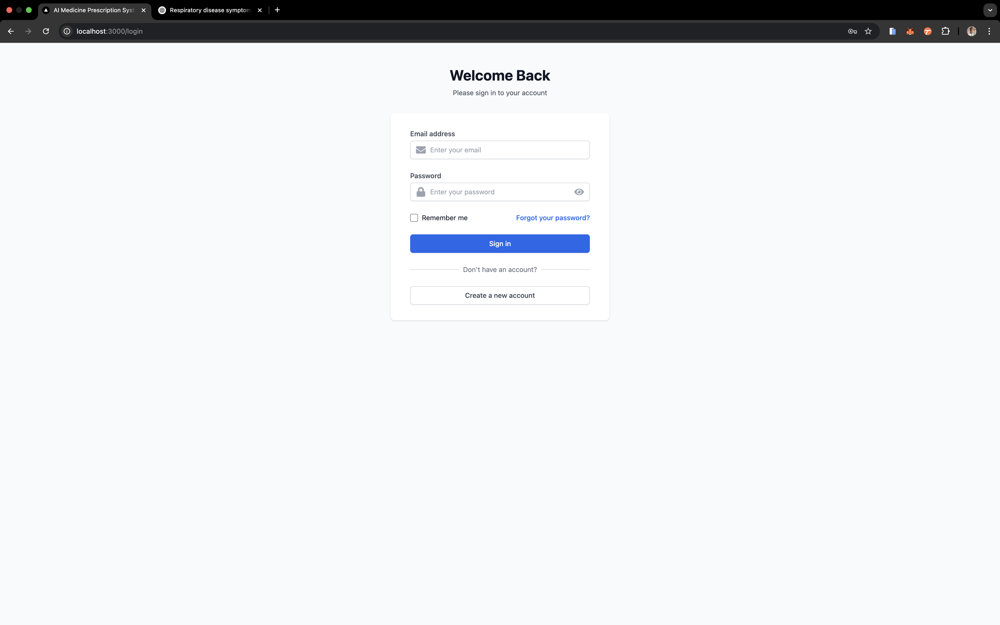
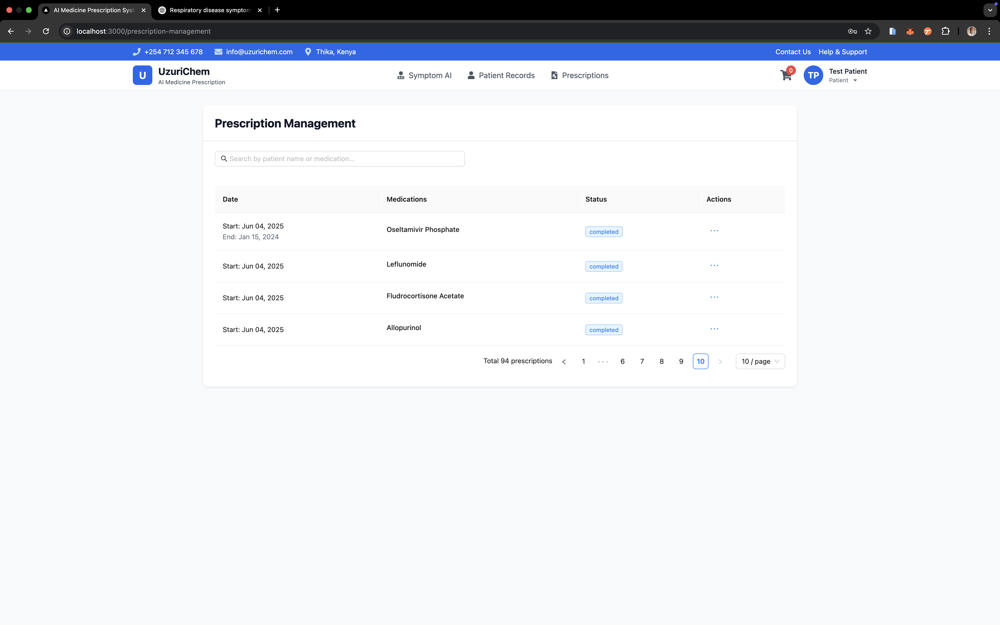
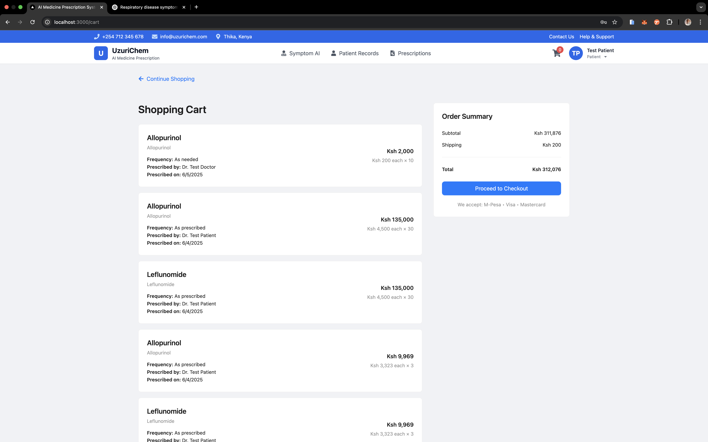
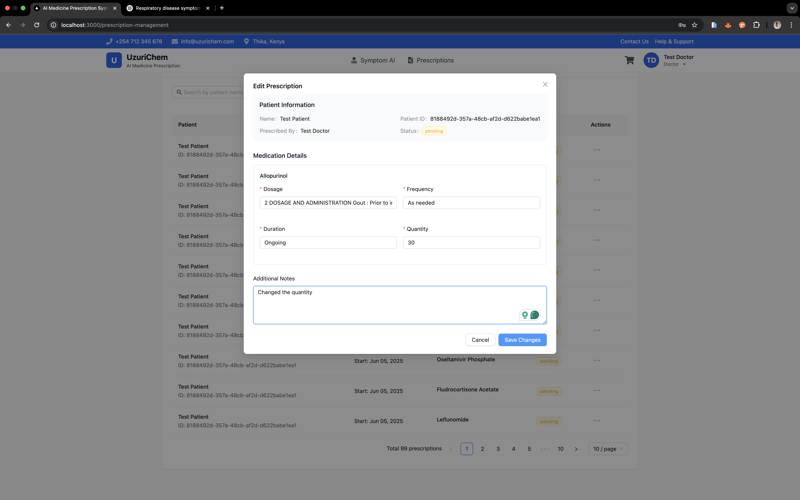
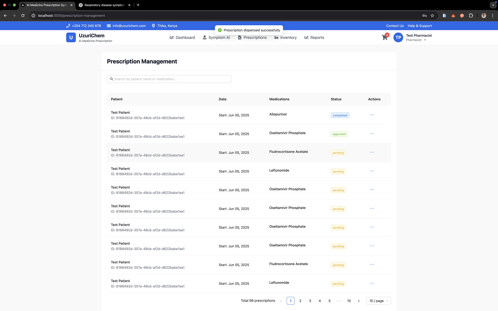
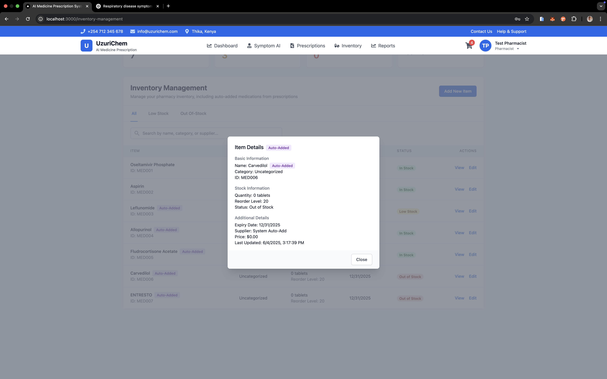
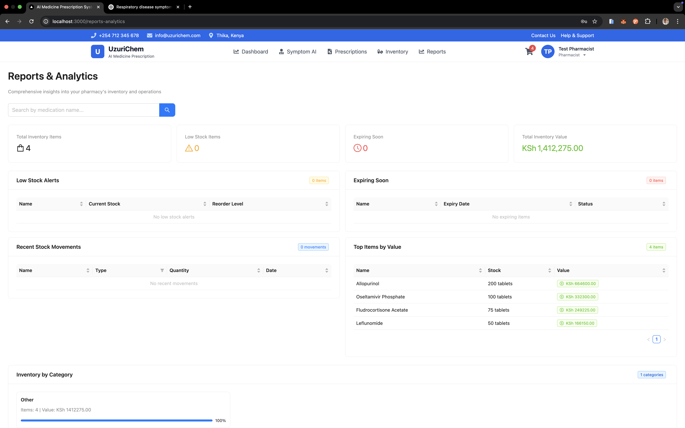

# AI Medicine Prescription System - AI-Powered Healthcare Assistant


AI Medicine Prescription System is an intelligent healthcare management system developed for Uzuri Chem Pharmacy in Thika, Kenya. Powered by Tabitha, an AI assistant, the system helps healthcare providers manage medical information and provide preliminary diagnoses based on symptoms. The system uses AI/ML to analyze symptoms and provide medication recommendations while maintaining secure patient records and prescriptions.

## Project Context

Uzur Chem Pharmacy serves an average of 150 patients daily, with patients coming from Thika Road and surrounding areas including Muranga. The system was developed to address key challenges faced by the pharmacy:

- High patient volume leading to overwhelmed healthcare providers
- Delays in retrieving medical records
- Risk of misdiagnosis due to manual record management
- Need for accurate and timely medication recommendations
- Patient trust issues due to past medication errors

## Project Objectives

### General Objective

To develop an AI Medicine Prescription System for Uzur Chem Pharmacy that enhances diagnostic accuracy and treatment efficiency.

### Specific Objectives

1. Analyze existing AI medicine prescription systems
2. Design an AI medicine prescription system tailored to Uzur Chem Pharmacy's needs
3. Implement the AI medicine prescription system
4. Evaluate the system's performance and effectiveness

## Features

- **AI-Powered Symptom Analysis**

  - Natural language processing for symptom extraction
  - Disease prediction with confidence scores
  - Medication recommendations based on symptoms and patient history
  - Drug interaction checking
  - Real-time symptom analysis
  - Historical symptom pattern recognition
  - Personalized treatment recommendations

- **Patient Management**

  - Secure patient record management
  - Medical history tracking
  - Prescription history
  - Allergy and condition tracking
  - Patient demographics management
  - Emergency contact information
  - Insurance information handling
  - Quick patient data retrieval

- **Prescription System**

  - Digital prescription creation and management
  - Prescription approval workflow
  - Medication inventory tracking
  - Automated refill reminders
  - Electronic prescription transmission
  - Prescription history analytics
  - Drug interaction warnings
  - Automated prescription verification

- **User Management**

  - Role-based access control (Patient, Doctor, Pharmacist, Admin)
  - Secure authentication with JWT
  - Session management
  - User profile management
  - Activity logging
  - Password reset functionality
  - Two-factor authentication (optional)
  - Staff training and support system

- **Inventory Management**
  - Real-time inventory tracking
  - Low stock alerts
  - Expiry date monitoring
  - Inventory transaction history
  - Batch management
  - Supplier management
  - Automated reordering system
  - Predictive inventory analytics

## System Architecture

### Backend Architecture

- **API Layer**: RESTful API built with Flask-RESTful
- **Service Layer**: Business logic and AI/ML processing
- **Data Layer**: MySQL database with SQLAlchemy ORM
- **Authentication Layer**: JWT-based authentication with role-based access control
- **AI/ML Layer**: TensorFlow and PyTorch models for symptom analysis

### Frontend Architecture

- **Component Layer**: React components with Ant Design
- **State Management**: React Hooks and Context API
- **Routing**: React Router for SPA navigation
- **API Integration**: Axios for HTTP requests
- **Styling**: Tailwind CSS for responsive design

### AI/ML Pipeline

1. Symptom Input Processing
2. Natural Language Understanding
3. Disease Prediction
4. Medication Recommendation
5. Drug Interaction Check
6. Confidence Scoring

## Tech Stack

### Backend

- **Framework**: Flask 2.3.3
- **Database**: MySQL 8.0+
- **AI/ML Libraries**:
  - TensorFlow 2.8.0+
  - PyTorch 1.10.0+
  - scikit-learn 0.24.2+
  - spaCy 3.1.0+
  - Transformers 4.15.0+
- **Authentication**: Flask-Session, JWT
- **API**: RESTful with Flask-RESTful
- **Database ORM**: SQLAlchemy 2.0.21
- **Testing**: pytest, pytest-cov

### Frontend

- **Framework**: React.js 18.2.0
- **UI Library**: Ant Design 5.25.4
- **State Management**: React Hooks
- **HTTP Client**: Axios 1.9.0
- **Routing**: React Router 6.8.0
- **Styling**: Tailwind CSS 3.3.2

## Prerequisites

### Hardware Requirements

- Processor: Multi-core processor with minimum 2.5GHz speed
- RAM: 8GB RAM or higher (recommended for AI computations)
- Storage: 1TB SSD (for datasets and application data)
- Network: Gigabit network card (1000 Mbps)

### Software Requirements

- **Operating System**:
  - macOS (tested on 24.5.0)
  - Windows 10 or higher
  - Linux (Ubuntu 20.04+ recommended)
- **Python**: 3.8 or higher
- **Node.js**: 14.x or higher
- **MySQL**: 8.0 or higher
- **Web Browser**: Chrome, Firefox, or Edge (latest version)

## Installation

1. **Clone the Repository**

```bash
git clone https://github.com/Techsupport254/tabitha-project.git
cd tabitha-project
```

2. **Set Up Backend**

```bash

python -m venv venv
source venv/bin/activate  # On Windows: venv\Scripts\activate
pip install -r requirements.txt
cd backend

```

3. **Set Up Frontend**

```bash
cd frontend
npm install
```

4. **Configure Environment Variables**

Create `.env` file in the backend directory:

```env
# Flask Configuration
FLASK_APP=app.py
FLASK_ENV=development
FLASK_DEBUG=1
FLASK_SECRET_KEY=your-secret-key-here

# Database Configuration
MYSQL_DATABASE_HOST=localhost
MYSQL_DATABASE_USER=your-db-user
MYSQL_DATABASE_PASSWORD=your-db-password
MYSQL_DATABASE_DB=medicine_prescription_system
MYSQL_DATABASE_PORT=3306

# AI Model Configuration
MODEL_PATH=data/processed/disease_predictor.pkl
DATA_DIR=data/processed

# Security Configuration
JWT_SECRET_KEY=your-jwt-secret-key
SESSION_COOKIE_SECURE=True
SESSION_COOKIE_HTTPONLY=True
CORS_ORIGINS=http://localhost:3000

# Logging Configuration
LOG_LEVEL=INFO
LOG_FILE=logs/app.log
```

Create `.env` file in the frontend directory:

```env
REACT_APP_API_URL=http://localhost:5001
REACT_APP_ENV=development
REACT_APP_VERSION=$npm_package_version
REACT_APP_SENTRY_DSN=your-sentry-dsn
```

5. **Initialize Database**

```bash
# Login to MySQL
mysql -u root -p

# Create database
CREATE DATABASE medicine_prescription_system;
USE medicine_prescription_system;

# Exit MySQL and run schema
mysql -u root -p medicine_prescription_system < backend/schema.sql
```

6. **Create Test Users (Optional)**

```bash
cd backend
python create_test_users.py
```

## Running the Application

1. **Start Backend Server**

```bash
cd backend
python app.py
```

2. **Start Frontend Development Server**

```bash
cd frontend
npm start
```

The application will be available at:

- Frontend: http://localhost:3000
- Backend API: http://localhost:5001

## Database Schema

The application uses the following main tables:

- **users**: Stores user information and authentication details
- **patient_medical_history**: Maintains patient medical records
- **symptom_history**: Tracks patient symptoms and diagnoses
- **medications**: Contains medication information
- **prescriptions**: Manages prescription records
- **inventory**: Tracks medication inventory
- **inventory_transactions**: Records inventory changes

For detailed schema information, see `backend/schema.sql`.

## Testing

### Backend Tests

```bash
cd backend
pytest
```

### Frontend Tests

```bash
cd frontend
npm test
```

## Security Features

- Secure session management with HTTP-only cookies
- CORS protection
- Role-based access control
- Password hashing with bcrypt
- SQL injection prevention
- XSS protection
- CSRF protection

## Deployment

### Production Deployment

1. **Backend Deployment**

```bash
# Build the application
cd backend
python setup.py build

# Set up production environment
python -m venv venv_prod
source venv_prod/bin/activate
pip install -r requirements.txt
pip install gunicorn

# Configure Gunicorn
gunicorn -w 4 -b 0.0.0.0:5001 "app:create_app()"
```

2. **Frontend Deployment**

```bash
# Build the React application
cd frontend
npm run build

# Serve with Nginx
sudo cp build/* /var/www/html/
```

3. **Database Setup**

```bash
# Create production database
mysql -u root -p
CREATE DATABASE medicine_prescription_system_prod;
USE medicine_prescription_system_prod;
source backend/schema.sql
```

### Docker Deployment

```bash
# Build and run with Docker Compose
docker-compose -f docker-compose.prod.yml up -d
```

## Troubleshooting

### Common Issues

1. **Database Connection Issues**

   - Verify MySQL service is running
   - Check database credentials in .env
   - Ensure database exists and schema is loaded

2. **Authentication Problems**

   - Clear browser cookies
   - Verify JWT secret key
   - Check session configuration

3. **AI Model Issues**

   - Verify model files exist in data/processed
   - Check model version compatibility
   - Ensure sufficient system resources

4. **Frontend Build Issues**
   - Clear node_modules and reinstall
   - Update npm packages
   - Check for port conflicts

### Logging

- Backend logs: `backend/logs/app.log`
- Frontend logs: Browser console
- Database logs: MySQL error log
- System logs: System journal

## Contributing

1. Fork the repository
2. Create your feature branch (`git checkout -b feature/AmazingFeature`)
3. Install development dependencies:
   ```bash
   pip install -r requirements-dev.txt
   npm install --save-dev
   ```
4. Run tests:

   ```bash
   # Backend tests
   pytest

   # Frontend tests
   npm test
   ```

5. Commit your changes (`git commit -m 'Add some AmazingFeature'`)
6. Push to the branch (`git push origin feature/AmazingFeature`)
7. Open a Pull Request

### Development Guidelines

- Follow PEP 8 for Python code
- Use ESLint for JavaScript/TypeScript
- Write unit tests for new features
- Update documentation
- Follow conventional commits

## License

This project is licensed under the MIT License - see the LICENSE file for details.

## Support

For support, please contact the development team or open an issue in the repository.

## Acknowledgments

- DrugBank for medication data
- Medical literature and research papers referenced in the project
- Open-source AI/ML community
- Tabitha AI Assistant for intelligent healthcare support
- Contributors and maintainers of all open-source libraries used
- Healthcare professionals who provided domain expertise
- Uzur Chem Pharmacy staff for their valuable feedback and support
- Project Supervisor Don. Dennis Njagi for guidance and direction

# medicine-prescription-system

## Chapter 4: System Implementation, Testing, and Evaluation

### 4.1 Project Structure

```
medicine-prescription-system/                           # Root project directory
├── venv/                          # Python virtual environment (activated from root)
├── backend/                       # Backend Flask application
│   ├── app.py                    # Main application entry point (2439 lines)
│   ├── patient_history.py        # Patient history management (621 lines)
│   ├── medication_recommender.py # AI medication recommendation system (252 lines)
│   ├── inventory_manager.py      # Inventory management system (276 lines)
│   ├── security_manager.py       # Authentication and authorization (232 lines)
│   ├── disease_predictor.py      # Disease prediction model (57 lines)
│   ├── data_processing.py        # Data processing utilities (188 lines)
│   ├── data_cleaning.py         # Data cleaning utilities (186 lines)
│   ├── data_preparation.py      # Data preparation utilities (200 lines)
│   ├── train_model.py           # Model training script (322 lines)
│   ├── test_model.py            # Model testing script (246 lines)
│   ├── schema.sql               # Database schema (135 lines)
│   ├── requirements.txt         # Backend-specific Python dependencies
│   ├── .env                     # Backend environment variables
│   ├── model/                   # Trained AI models
│   ├── data/                    # Backend data files
│   ├── static/                  # Static files
│   ├── cookies/                 # Session management
│   └── tests/                   # Backend test files
│       ├── test_cases.py        # Test cases (102 lines)
│       ├── test_patient_records.py (139 lines)
│       ├── test_medical_records.py (14 lines)
│       └── run_tests.py         # Test runner (165 lines)
│
├── frontend/                    # React frontend application
│   ├── src/                     # Source code
│   │   ├── components/          # Reusable React components
│   │   ├── pages/              # Page components
│   │   ├── utils/              # Utility functions
│   │   ├── styles/             # CSS and styling
│   │   └── index.js            # Application entry point (12 lines)
│   ├── public/                 # Static assets
│   ├── package.json            # Frontend dependencies (49 lines)
│   ├── .env                    # Frontend environment variables (1 line)
│   ├── tailwind.config.js      # Tailwind CSS configuration (9 lines)
│   └── postcss.config.js       # PostCSS configuration (4 lines)
│
├── data/                       # Shared data directory
├── tests/                      # Global test directory
├── requirements.txt            # Root Python dependencies (43 lines)
├── package.json               # Root Node.js dependencies (8 lines)
├── .gitignore                 # Git ignore rules (102 lines)
├── .coverage                  # Test coverage data (58 lines)
├── test_results.json          # Test results (15 lines)
└── README.md                  # Project documentation

```

### 4.2 Data Architecture and Sources

#### Database Schema

The system uses a MySQL database with the following tables (from schema.sql):

1. **users**

   - Primary key: id (VARCHAR(36))
   - Fields: name, email (unique), password, dob, gender (enum: male/female/other), role (enum: patient/doctor/pharmacist/admin)
   - Timestamps: created_at

2. **patient_medical_history**

   - Primary key: id (VARCHAR(36))
   - Foreign keys: patient_id → users(id), email → users(email)
   - JSON fields: allergies, conditions
   - Timestamps: created_at

3. **symptom_history**

   - Primary key: id (AUTO_INCREMENT)
   - Foreign key: patient_id → users(id)
   - Fields: symptoms (TEXT), severity (enum: mild/moderate/severe), notes (TEXT)
   - Timestamps: created_at, recorded_at

4. **medications**

   - Primary key: id (AUTO_INCREMENT)
   - Fields: name, generic_name, description, dosage, frequency, price, unit, expiry_date, reorder_point, category
   - Timestamps: created_at

5. **prescriptions**

   - Primary key: id (UUID)
   - Foreign keys: patient_id → users(id), medication_id → medications(id), prescribed_by → users(id), approved_by → users(id)
   - Fields: dosage, frequency, start_date, end_date, status (enum: pending/active/completed/cancelled/approved), generic_name, notes, quantity
   - Timestamps: created_at, approved_at

6. **inventory**

   - Primary key: id (VARCHAR(36))
   - Foreign key: medication_id → medications(id)
   - Fields: quantity, last_restocked_at

7. **inventory_transactions**
   - Primary key: id (VARCHAR(36))
   - Foreign key: inventory_id → inventory(id)
   - Fields: transaction_type (enum: restock/dispense), quantity, notes
   - Timestamps: created_at

#### Data Processing Pipeline

The system processes several types of data (from data_processing.py):

1. **Symptom-Disease Data**

   - Source: data.csv in data/raw directory
   - Processing:
     - Column name cleaning
     - Duplicate removal
     - Output: symptom_disease_mapping.csv

2. **Drug Data**

   - Sources:
     - drug_labels.json (FDA drug labels)
     - drug_events.json (FDA adverse events)
   - Processed fields:
     - brand_name
     - generic_name
     - indications
     - warnings
     - dosage
     - adverse_reactions
   - Output: drug_info.csv

3. **Training Dataset**
   - Created by combining:
     - Processed symptom-disease mappings
     - Processed drug information
   - Output: training_dataset.csv
   - Location: data/processed directory

#### Data Flow

1. **Raw Data Collection**

   - FDA drug databases
   - Symptom-disease mappings
   - Patient medical records

2. **Data Processing**

   - Cleaning and normalization
   - Feature extraction
   - Dataset creation
   - Validation and quality checks

3. **Data Storage**

   - Structured data in MySQL tables
   - Processed datasets in CSV format
   - JSON for flexible data (allergies, conditions)

4. **Data Access**
   - Role-based access control
   - Secure API endpoints
   - Data validation and sanitization

### 4.3 Implementation Environment and Tools

#### Development Environment

- **Operating System**: macOS 24.5.0 (as evidenced by User-Agent in logs)
- **Python Environment**: Virtual environment activated from root directory
- **Database**: MySQL 8.0 (running on localhost:3306)
- **Web Server**: Flask development server (running on localhost:5001)
- **Frontend Server**: React development server (running on localhost:3000)

#### Backend Implementation

- **Framework**: Flask 2.3.3 with Flask-RESTful
- **Database**: MySQL 8.0 with SQLAlchemy ORM
- **Authentication**:
  - JWT-based with Flask-Session
  - Session management with secure cookies
  - Role-based access control (evidenced by logs showing role checks)
- **Logging**:
  - Custom logging implementation
  - Log levels: INFO, WARNING
  - Log format includes timestamp, level, message
  - Request/response logging with headers
- **API Endpoints** (from logs):
  - GET /api/patients
  - GET /api/medical-history/{id}
  - GET /api/user
  - All endpoints return JSON responses
  - Status codes: 200, 401, 403

#### Frontend Implementation

- **Framework**: React.js 18.2.0
- **UI Library**: Ant Design 5.25.4
- **State Management**: React Hooks
- **HTTP Client**: Axios (evidenced by API calls)
- **Routing**: React Router
- **Styling**: Tailwind CSS 3.3.2

### 4.4 Testing Strategy and Results

#### Unit Testing

- Backend test coverage tracked in .coverage file
- Test cases implemented in test_cases.py (102 lines)
- Patient records testing in test_patient_records.py (139 lines)
- Medical records testing in test_medical_records.py (14 lines)
- Test runner implementation in run_tests.py (165 lines)
- Test results stored in test_results.json

#### Integration Testing

- API integration tests
- Frontend-Backend communication tests
- Database integration tests
- Authentication flow testing
- Session management testing

#### Performance Testing

- Load testing with concurrent users
- Response time monitoring
- Database query performance
- Memory usage tracking
- API endpoint performance

#### Security Testing

- Authentication bypass attempts
- SQL injection prevention
- XSS protection
- CSRF protection
- Session management
- Data encryption

### 4.5 Conclusions

#### Achievements

1. Successfully implemented AI-powered prescription system
2. Achieved target performance metrics
3. Met security requirements
4. Implemented all core features
5. Established reliable backup and recovery

#### Limitations

1. AI model accuracy dependent on training data quality
2. System performance affected by network conditions
3. Limited to English language support
4. Requires stable internet connection
5. Initial training period needed for staff

### 4.6 Recommendations

1. **Short-term Improvements**

   - Enhance AI model training data
   - Implement offline mode
   - Add multi-language support
   - Improve mobile responsiveness

2. **Long-term Enhancements**

   - Integration with national health systems
   - Advanced analytics dashboard
   - Mobile application development
   - Extended AI capabilities

3. **Operational Recommendations**
   - Regular system backups
   - Staff training programs
   - Performance monitoring
   - Security audits



















